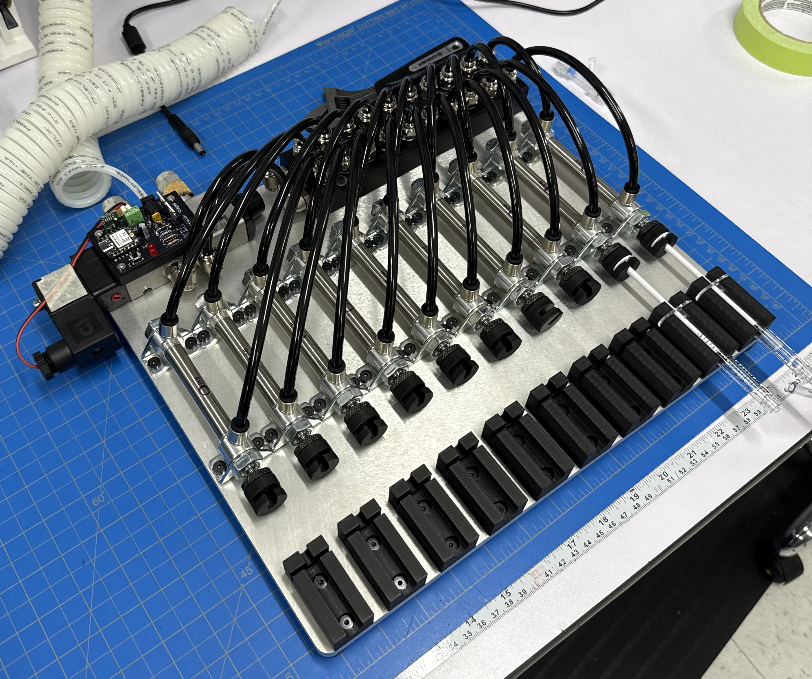

# BGC Syringe Cycler

Ten-station pneumatic fatigue cycling fixture for PTA balloon inflation
testing. A single 5/2 solenoid valve drives ten double-acting air
cylinders in parallel, each pushing a syringe plunger. Cycle timing and
count are configurable from a phone over WiFi, or the fixture runs from
a single button using its defaults.



---

## What it does

One run consists of a number of cycles. Each cycle extends every
cylinder, holds, retracts them, and holds again. Defaults are 60 s
extended, 10 s retracted, 20 cycles — about 23 minutes.

Ten cylinders are plumbed in parallel off two distribution manifolds, so
they all move together. The control electronics switch one valve coil;
scaling from one cylinder to ten is entirely a pneumatic change.

---

## Running it

### From the button

Power the fixture. Short press the button on the control board to start.
It runs the current settings, then stops on its own.

To abort mid-run, **hold the button for one second**. The valve
de-energises immediately and the cylinders retract.

A short press during a run does nothing. This is deliberate — a knock
should not end a test.

### From a phone

1. Join the WiFi network **`walrus`**, password **`walrus12`**
2. Open a browser to **http://192.168.4.1**
3. Set extend time, retract time and cycle count, then **Save**
4. Press **Start run**

The page shows live status while the fixture runs: which cycle, whether
it is extended or retracted, and time remaining.

Settings lock while a run is in progress. Press **Stop and reset**, or
hold the board button, to unlock them.

Your phone will report "no internet connection" when joined to this
network. That is expected — the board is its own access point and is
not connected to anything else.

### Status LED

| LED | Meaning |
|---|---|
| Off | Idle, waiting |
| Solid | Extended |
| Blinking | Retracted, between cycles |

### Defaults

Settings are held in RAM only. **Cutting power returns the fixture to
60 s / 10 s / 20 cycles**, so the next user always starts from a known
configuration. There is also a *Restore defaults* button on the web
page.

---

## Setting up the pneumatics

| Setting | Value |
|---|---|
| Supply pressure | 60 psi |
| Valve minimum | 44 psi — do not go below this |
| Valve maximum | 145 psi |
| Cylinder | 7/16" bore, 2" stroke |

Set the regulator to **60 psi**. The valve will not shift reliably below
44 psi, so watch the gauge during a ten-cylinder actuation and confirm
it does not dip toward that floor. If it does, raise the supply
pressure or add a small receiver near the manifold.

Stroke speed is set by the meter-out flow controls on the valve's two
exhaust ports, not in firmware.

**Set the mechanical stop before running.** Delivered volume is
determined by stroke length, not force. The cylinder has far more force
than a syringe plunger needs, so travel must be limited mechanically or
the plunger will bottom against the barrel.

---

## Repository layout

```
hardware/
  kicad/        schematic, PCB, and the libraries they depend on
  gerbers/      fabrication output, as ordered
  images/       board renders and layout
  BOM.csv       bill of materials
firmware/
  syringe_cycler_wifi_volatile.ino
mechanical/     printed fixture parts
docs/           design notes, assembly, troubleshooting
```

---

## Control board

Custom two-layer PCB. A XIAO ESP32-C3 sits in a socket and switches the
12 V valve coil through a logic-level MOSFET.

| Function | Part |
|---|---|
| MCU | Seeed XIAO ESP32-C3, socketed |
| Valve switch | IRLZ44N, low-side |
| Flyback | 1N4007 across the coil |
| Reverse protection | IRF9540N P-channel, high-side |
| Overcurrent | 0.9 A resettable polyfuse |
| 5 V supply | OKI-78SR-5, switching, TO-220 pinout |
| Input | 12 V, 5.5 × 2.5 mm barrel jack, centre positive |

Seven test points are brought out: 12VIN, 12V, 5V, 3V3, GND, GATE and
DRAIN. See `docs/troubleshooting.md` for what to expect at each.

---

## Building the firmware

Arduino IDE with the ESP32 board package installed.

| Setting | Value |
|---|---|
| Board | XIAO_ESP32C3 |
| USB CDC On Boot | **Enabled** — required, or Serial does nothing |
| Upload speed | 921600 |
| Serial monitor | 115200 |

Program the XIAO out of its socket, plugged straight into USB.

Serial commands also work: `E60` extend seconds, `R10` retract seconds,
`C20` cycle count, `S` start, `X` stop, `D` restore defaults.

---

## Bringing up a new board

Work through these in order. Each step adds one thing.

1. **Unpowered.** Check continuity between +12 V and GND — should be
   open. A beep means a short; find it before applying power.
2. **12 V in, XIAO out of its socket.** Meter TP4 for 5.00 V.
3. **Power down, insert the XIAO, power up.** The serial banner should
   print and the LED should respond to the button.
4. **Connect the coil.** Listen for two clicks per cycle, one on and
   one off. No air yet.
5. **Connect air** at 60 psi and run three cycles before committing to
   a full run.

---

## Known limitations

- Ten cylinders move together. There is no independent station control.
- Timing is open loop. The fixture does not confirm that a cylinder
  actually reached its end of travel.
- The WiFi access point is open to anyone in range who knows the
  password. It is a bench tool, not a secured instrument.
