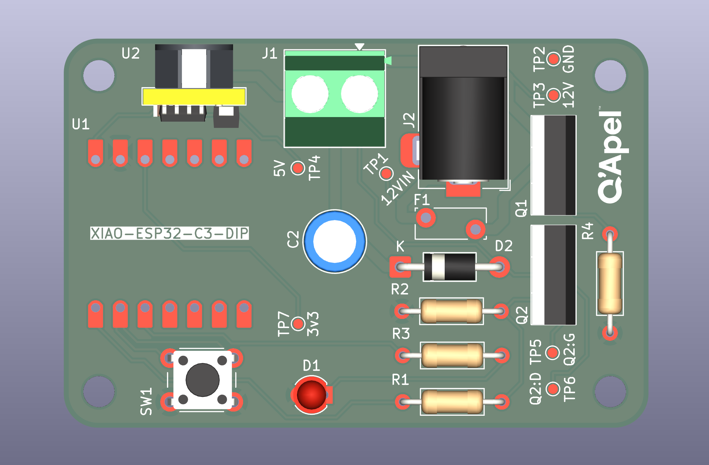

# BGC Syringe Cycler

Ten-station pneumatic fatigue cycling fixture for balloon guide catheter
inflation testing. A single 5/2 solenoid valve drives ten double-acting
air cylinders in parallel, each actuating a 1 mL Merit Medical Medallion
syringe. Pusher and mount spacing fixes the stroke to displace ~0.6 mL
per cycle.

The cycling regime is adapted from ISO 10555-4:2023 Annex B (balloon
fatigue / repeated inflation). Annex B is written for dilatation
balloons and cycles to rated burst pressure; a balloon guide catheter is
specified by recommended inflation volume rather than RBP, so the
fixture cycles a fixed displaced volume instead. Annex B's default of 10
cycles is likewise adapted — the fixture defaults to 20 — which the
standard permits where supported by risk assessment.

Cycle timing is configurable to accommodate different test fluids —
viscous media such as contrast refill the syringe more slowly than
saline or DI water. Timing and cycle count can be set from any device
over WiFi, or the fixture can be run from a single button using its DI
water / saline defaults (60s on, 10s off, 20 cycles).


---

## What it does

A run repeats one cycle: all ten cylinders extend, hold, retract, hold.
Defaults are 60 s extended, 10 s retracted, 20 cycles — about 23 minutes.

The cylinders are plumbed in parallel off two distribution manifolds, so
they move together. The controller switches a single valve coil, so
station count is a pneumatic change, not an electrical one.

---

## Running it

### From the button

Power the PCB from a 12 V DC supply (2.5 mm barrel jack, 1 A min).
Short-press the button on the control board to start. The run uses the
current settings and stops on its own. Defaults are 60 s extended,
10 s retracted, 20 cycles.

To abort mid-run, **press and hold the button for 1 second.** The valve
de-energizes immediately and the cylinders retract. A short press during
an active run does nothing, by design.

To change timing or cycle count, see the next section.

### From any device

1. Join the WiFi network **`walrus`**, password **`walrus123`**
2. Open a browser to **192.168.4.1** (add `http://` if the browser tries
to search instead of navigate).
3. Set extend time, retract time and cycle count, then **Save**
4. Press **Start run**

The page shows live status while the fixture runs: which cycle, whether
it is extended or retracted, and time remaining.

Settings lock while a run is in progress. Press **Stop and reset**, or
hold the board button, to unlock them.

Your phone will report "no internet connection" — expected, since the
board is its own access point. If your phone drops the network
automatically, tell it to stay connected when prompted.

The run continues if you disconnect. Reconnect any time to see live
status or stop the run.

### Status LED

| LED | Meaning |
|---|---|
| Off | Idle, waiting |
| Solid | Extended |
| Blinking | Retracted, between cycles |

### Defaults

Settings are held in RAM only. **Cutting power returns the fixture to
60 s / 10 s / 20 cycles**, so the next user always starts from a known
configuration. There is also a *Restore defaults* button on the web
page.

---

## Setting up the pneumatics

| Setting | Value |
|---|---|
| Supply pressure | 60 psi |
| Valve minimum | 44 psi — do not go below this |
| Valve maximum | 145 psi |
| Cylinder | 7/16" bore, 2" stroke |

Set the regulator to **60 psi**. The valve will not shift reliably below 44 psi, so watch the gauge during a ten-cylinder actuation and confirm it does not dip toward that floor. If it does, raise the supply pressure.

Stroke speed is set by the meter-out flow controls on the valve's two exhaust ports, not in firmware.

**Verify stroke before the first run.** The printed pusher bottoms
against the stationary mount, which fixes delivered volume at ~0.6 mL. Cycle once dry and confirm the pusher contacts the mount versus if plunger reaches the end of the barrel.

---

## Repository layout

```
bgc-syringe-cycler/
├── docs/
│   ├── images/                          photos and reference images
│   ├── design-notes.md                  reasoning behind major decisions
│   └── firmware-setup.md                Arduino IDE and board setup
├── firmware/
│   └── syringe_cycler_wifi_volatile.ino
├── hardware/
│   ├── gerbers/                         fabrication output, as ordered
│   ├── images/                          board renders and layout
│   ├── kicad/                           schematic, PCB, dependent libraries
│   └── snoid-swt-BOM.csv                control board bill of materials
├── mechanical/
│   ├── step/                            neutral CAD exports
│   ├── sw-pack-n-go/                    SolidWorks source
│   ├── bgc-inflation-fatigue-assy.pdf   assembly drawing
│   └── mechanical-BOM.csv               fixture bill of materials
├── .gitignore
├── LICENSE
└── README.md
```

Hardware, firmware, and mechanical source for the fixture, plus the
build and setup documentation.


---

## Control board

Custom two-layer PCB ordered from JLPCB. A XIAO ESP32-C3 sits in a socket and switches the 12 V valve coil through a logic-level MOSFET.



| Function | Part |
|---|---|
| MCU | Seeed XIAO ESP32-C3, socketed |
| Valve switch | IRLZ44N, low-side |
| Flyback | 1N4007 across the coil |
| Reverse protection | IRF9540N P-channel, high-side |
| Overcurrent | 0.9 A resettable polyfuse |
| 5 V supply | OKI-78SR-5, switching, TO-220 pinout |
| Input | 12 V, 5.5 × 2.5 mm barrel jack, centre positive |

Seven test points are brought out: 12VIN, 12V, 5V, 3V3, GND, GATE and
DRAIN. See `docs/troubleshooting.md` for what to expect at each.

---

## Building the firmware

Arduino IDE with the ESP32 board package installed.

| Setting | Value |
|---|---|
| Board | XIAO_ESP32C3 |
| USB CDC On Boot | **Enabled** — required, or Serial does nothing |
| Upload speed | 921600 |
| Serial monitor | 115200 |

Program the XIAO out of its socket, plugged straight into USB.

Serial commands also work: `E60` extend seconds, `R10` retract seconds,
`C20` cycle count, `S` start, `X` stop, `D` restore defaults.

---

## Bringing up a new board

Work through these in order.

1. **Unpowered.** Check continuity between +12 V and GND — should be
   open. A beep means a short; find it before applying power.
2. **12 V in, XIAO out of its socket.** Meter TP4 for 5.00 V.
3. **Power down, insert the XIAO, power up.** The serial banner should
   print and the LED should respond to the button.
4. **Connect the coil.** Listen for two clicks per cycle, one on and
   one off. No air yet.
5. **Connect air** at 60 psi and run three cycles before committing to
   a full run.

---

## Known limitation

- Ten cylinders move together. There is no independent station control.
- Timing is open loop. The fixture does not confirm that a cylinder
  actually reached its end of travel.
- The WiFi access point is open to anyone in range who knows the
  password. It is a DV bench fixture, not a secured instrument.